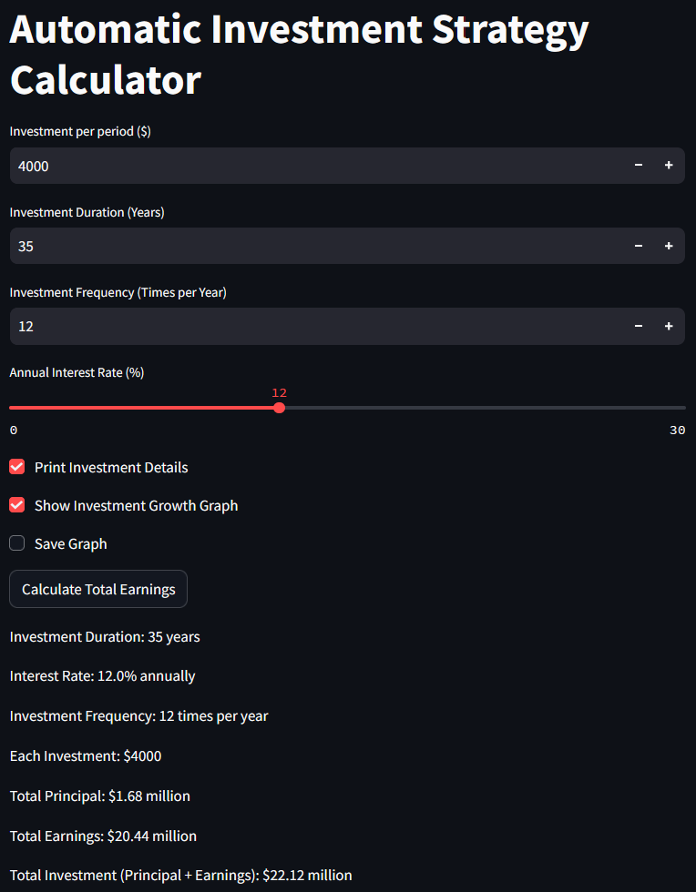
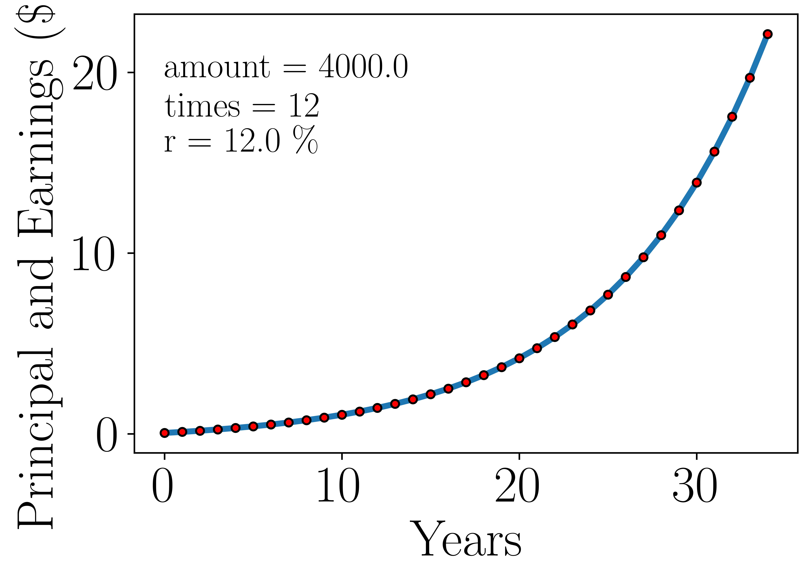

# Automatic Investment Strategy Calculator

This project provides tools to **model and visualize automatic (DCA-style) investment strategies** using Python and Streamlit.

There are two main entry points:

- `Interactive_dashboard.py` – a Streamlit web dashboard for interactive exploration.
- `automatic_investment_plan.py` – a more general simulation script (with optional initial capital) plus an alternative Streamlit interface.

---

## Features

- 🔢 **Flexible inputs**
  - Investment per period (e.g., monthly contribution)
  - Investment duration in years
  - Number of investments per year (frequency)
  - Annual return rate
  - Optional initial capital (in `automatic_investment_plan.py`)
- 📋 **Detailed output**
  - Total principal invested
  - Total earnings
  - Total portfolio value (principal + earnings)
- 📈 **Growth visualization**
  - Matplotlib charts showing portfolio value over time
- 🧩 **Reusable classes**
  - `Investment` classes you can import into other projects for further analysis or back-testing.

---

## Example Dashboard

> Example: \$4,000 per period, 35 years, 12 investments per year, 12% annual return.

<p align="center">
  
</p>

---

## Example Growth Curve

This graph shows the growth of **principal + earnings** (in millions) over a 35-year horizon for the same parameters as above.

<p align="center">
  
</p>

---

## Project Structure

```text
.
├── Interactive_dashboard.py      # Streamlit dashboard (no initial capital parameter)
├── automatic_investment_plan.py  # Core simulation + optional Streamlit interface
├── Interactive_dashboard_screenshot.png
├── Investment_t=35_p=4000.0_a=12_r=12.0.jpg
└── README.md
