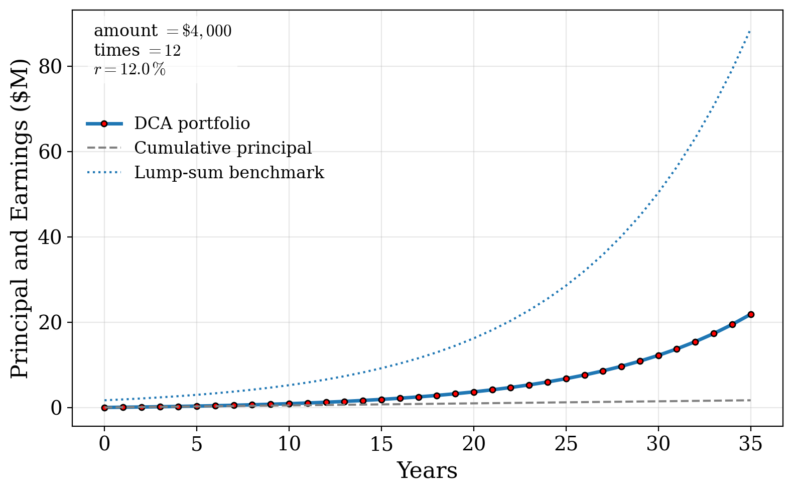
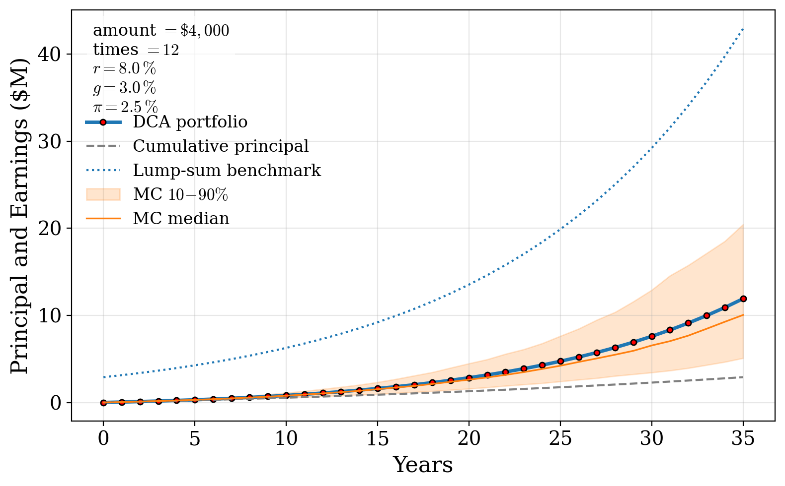

# Automatic Investment Strategy Calculator

A small toolkit for **modelling dollar-cost-averaging (DCA) investment plans**
in Python, with a Streamlit dashboard, a CLI script, and a tested core math
module.

## What it does

- **Deterministic DCA simulation** with year-by-year balance, contributions,
  earnings, and return on principal.
- **Inflation-adjusted ("real") values** when an inflation rate is provided.
- **Lump-sum benchmark** for comparison (what if the same total principal had
  been invested in one shot at t=0?).
- **Contribution growth** (e.g. raise contributions 3 %/yr).
- **Monte Carlo overlay** sampling annual returns from
  $\mathcal{N}(\mu, \sigma^2)$ with a 10–90 % percentile fan and median path.
- **CSV export** of the full year-by-year table.

## Example output

\$4,000/month for 35 years at 12 % annual return (effective compounding):

<p align="center">
  
</p>

Same horizon at a more realistic 8 % expected return, with 3 %/yr
contribution growth, 2.5 %/yr inflation, and a 10–90 % Monte Carlo fan
(σ = 15 %, 2,000 paths):

<p align="center">
  
</p>

Regenerate these figures with:

```bash
python automatic_investment_plan.py \
    --contribution 4000 --years 35 --times 12 --return 0.12 \
    --save-plot docs/dca_growth.png \
    --csv docs/dca_year_by_year.csv

python automatic_investment_plan.py \
    --contribution 4000 --years 35 --times 12 --return 0.08 \
    --growth 0.03 --inflation 0.025 \
    --mc --mc-sigma 0.15 --mc-paths 2000 \
    --save-plot docs/dca_growth_mc.png
```

## Project structure

```text
.
├── dca/
│   ├── __init__.py
│   ├── investment.py        # SimulationParams + simulate() + summary()
│   ├── monte_carlo.py       # monte_carlo() with percentile output
│   └── plotting.py          # matplotlib helpers (serif + mathtext)
├── tests/
│   ├── conftest.py
│   ├── test_investment.py   # closed-form annuity FV checks
│   └── test_monte_carlo.py
├── docs/                    # generated README figures (PNGs are tracked)
├── automatic_investment_plan.py   # CLI entry point
├── Interactive_dashboard.py       # Streamlit dashboard
├── LICENSE
└── README.md
```

## Install

This folder uses the workspace-level `.venv` and its top-level
`requirements.txt` (which includes `streamlit`). From the workspace root:

```bash
./.venv/bin/pip install -r requirements.txt
```

## Usage

### Streamlit dashboard

```bash
streamlit run Interactive_dashboard.py
```

Inputs are in the sidebar; the main pane shows headline metrics, a growth
chart with optional Monte Carlo fan, a year-by-year table, and a CSV
download button.

### CLI

```bash
python automatic_investment_plan.py \
    --contribution 4000 --years 35 --times 12 --return 0.12 \
    --save-plot docs/dca_growth.png \
    --csv docs/dca_year_by_year.csv
```

If you pass neither `--plot` nor `--save-plot`, the script auto-saves a
default chart to `docs/dca_growth.png` so it shows up in the README. Use
`--no-plot` to skip plotting entirely, `--plot` to also open a window, and
`--mc` to add a Monte Carlo overlay (tunable via `--mc-sigma`,
`--mc-paths`, `--mc-seed`).

`python automatic_investment_plan.py --help` lists every option (initial
capital, contribution growth, inflation, compounding convention,
end-vs-begin timing, save plot to file, …).

### Library

```python
from dca import SimulationParams, simulate, summary, monte_carlo

params = SimulationParams(
    contribution=4000, years=35, times_per_year=12,
    annual_return=0.08, contribution_growth=0.03, inflation=0.025,
)
df = simulate(params)
print(summary(df, params))

mc = monte_carlo(params, sigma=0.15, n_paths=2000, seed=42)
print(mc.percentiles.tail())
```

## Math conventions

For an annual return $r$ and $m$ contributions per year, the per-period rate
$i$ depends on the convention:

- **Effective** (default): $i = (1+r)^{1/m} - 1$. Realised annual return
  matches the input $r$ exactly.
- **Nominal (APR)**: $i = r/m$. Realised annual return is $(1+r/m)^m - 1$,
  slightly above $r$.

End-of-period DCA is the ordinary-annuity FV after $n = m \cdot T$ periods:

$$\text{FV} = P \cdot \frac{(1+i)^n - 1}{i}$$

Begin-of-period (annuity-due) multiplies that by $(1+i)$. Tests anchor both
forms on these closed-form expressions.

## Tests

From this folder:

```bash
../.venv/bin/python -m pytest tests/ -v
```

20 tests cover: input validation, zero-return sanity, ordinary annuity vs
annuity-due relationship, both compounding conventions, initial-capital
compounding, inflation columns, contribution growth, Monte Carlo determinism
under a fixed seed, and percentile ordering.
